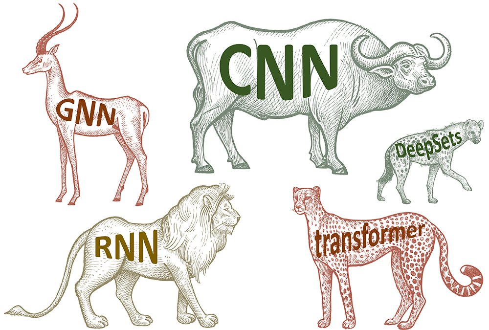

<H1> 
 Model Zoo 
</H1>
<h3>
A collection of various deep learning models, in TensorFlow2 and PyTorch. 

 

    
    
    
    
    
    

## Basic Models

Perceptron
- PyTorch : [Github](https://github.com/siAyush/Model-Zoo/blob/main/pytorch/01_perceptron.ipynb) | [Nbviewer](https://nbviewer.jupyter.org/github/siAyush/Model-Zoo/blob/main/pytorch/01_perceptron.ipynb)
- TensorFlow : [Github]() | [Nbviewer]()

Logistic Regression
- PyTorch : [Github](https://github.com/siAyush/Model-Zoo/blob/main/pytorch/02_logistic_regression.ipynb) | [Nbviewer](https://nbviewer.jupyter.org/github/siAyush/Model-Zoo/blob/main/pytorch/02_logistic_regression.ipynb)
- TensorFlow : [Github]() | [Nbviewer]()

Multilayer Perceptron
- PyTorch : [Github](https://github.com/siAyush/Model-Zoo/blob/main/pytorch/03_multilayer_perceptron.ipynb) | [Nbviewer](https://nbviewer.jupyter.org/github/siAyush/Model-Zoo/blob/main/pytorch/03_multilayer_perceptron.ipynb)
- TensorFlow : [Github]() | [Nbviewer]()

## Convolutional Neural Network (CNNs)

Convolutional Neural Network
- PyTorch : [Github](https://github.com/siAyush/Model-Zoo/blob/main/pytorch/04_cnn.ipynb) | [Nbviewer](https://nbviewer.jupyter.org/github/siAyush/Model-Zoo/blob/main/pytorch/04_cnn.ipynb)
- TensorFlow : [Github]() | [Nbviewer]()

LeNet

- LeNet-5 on MNIST
  - PyTorch : [Github](https://github.com/siAyush/Model-Zoo/blob/main/pytorch/05_lenet5-mnist.ipynb) | [Nbviewer](https://nbviewer.jupyter.org/github/siAyush/Model-Zoo/blob/main/pytorch/05_lenet5-mnist.ipynb)
- LeNet-5 on CIFAR-10
  - PyTorch : [Github](https://github.com/siAyush/Model-Zoo/blob/main/pytorch/06_lenet5_cifar10.ipynb) | [Nbviewer](https://nbviewer.jupyter.org/github/siAyush/Model-Zoo/blob/main/pytorch/06_lenet5_cifar10.ipynb)

AlexNet

- AlexNet on CIFAR-10
  - PyTorch : [Github](https://github.com/siAyush/Model-Zoo/blob/main/pytorch/07_alexnet-cifar10.ipynb) | [Nbviewer](https://nbviewer.jupyter.org/github/siAyush/Model-Zoo/blob/main/pytorch/07_alexnet-cifar10.ipynb)

VGG

- VGG-16 on CIFAR-10
  - PyTorch : [Github](https://github.com/siAyush/Model-Zoo/blob/main/pytorch/08_vgg16_cifar10.ipynb) | [Nbviewer](https://nbviewer.jupyter.org/github/siAyush/Model-Zoo/blob/main/pytorch/08_vgg16_cifar10.ipynb)
- VGG-19 on CIFAR-10
  - PyTorch : [Github](https://github.com/siAyush/Model-Zoo/blob/main/pytorch/09_vgg19_cifar10.ipynb) | [Nbviewer](https://nbviewer.jupyter.org/github/siAyush/Model-Zoo/blob/main/pytorch/09_vgg19_cifar10.ipynb)

ResNet

- ResNet-34 on MNIST
  - PyTorch : [Github](https://github.com/siAyush/Model-Zoo/blob/main/pytorch/10_resnet34_mnist.ipynb) | [Nbviewer](https://nbviewer.jupyter.org/github/siAyush/Model-Zoo/blob/main/pytorch/10_resnet34_mnist.ipynb)
- ResNet-50 on MNIST
  - PyTorch : [Github](https://github.com/siAyush/Model-Zoo/blob/main/pytorch/11_resnet50_mnist.ipynb) | [Nbviewer](https://nbviewer.jupyter.org/github/siAyush/Model-Zoo/blob/main/pytorch/11_resnet50_mnist.ipynb)
- ResNet-101 on CIFAR-10
  - PyTorch : [Github](https://github.com/siAyush/Model-Zoo/blob/main/pytorch/12_resnet101_cifar10.ipynb) | [Nbviewer](https://nbviewer.jupyter.org/github/siAyush/Model-Zoo/blob/main/pytorch/12_resnet101_cifar10.ipynb)
  
Network in Network
  
- Network in Network on CIFAR-10
  - PyTorch : [Github](https://github.com/siAyush/Model-Zoo/blob/main/pytorch/13_nin_cifar10.ipynb) | [Nbviewer](https://nbviewer.jupyter.org/github/siAyush/Model-Zoo/blob/main/pytorch/13_nin_cifar10.ipynb)

DenseNet
  
- DenseNet-121 on CIFAR-10
  - PyTorch : [Github](https://github.com/siAyush/Model-Zoo/blob/main/pytorch/14_densenet_cifar10.ipynb) | [Nbviewer](https://nbviewer.jupyter.org/github/siAyush/Model-Zoo/blob/main/pytorch/14_densenet_cifar10.ipynb)

## Transfer Learning

- Transfer Learning Example (VGG16 pre-trained on ImageNet for Cifar-10)
  - PyTorch : [Github](https://github.com/siAyush/Model-Zoo/blob/main/pytorch/15_transfer_learning.ipynb) | [Nbviewer](https://nbviewer.jupyter.org/github/siAyush/Model-Zoo/blob/main/pytorch/15_transfer_learning.ipynb)

## Recurrent Neural Networks (RNNs) 

Many-to-one: Sentiment Analysis / Classification

- A simple single-layer RNN on IMDB
  - PyTorch : [Github](https://github.com/siAyush/Model-Zoo/blob/main/pytorch/16_rnn.ipynb) | [Nbviewer](https://nbviewer.jupyter.org/github/siAyush/Model-Zoo/blob/main/pytorch/16_rnn.ipynb)

- RNN with LSTM cells on IMDB
  - PyTorch : [Github](https://github.com/siAyush/Model-Zoo/blob/main/pytorch/17_lstm.ipynb) | [Nbviewer](https://nbviewer.jupyter.org/github/siAyush/Model-Zoo/blob/main/pytorch/17_lstm.ipynb)

- RNN with GRU cells on IMDB 
  - PyTorch : [Github](https://github.com/siAyush/Model-Zoo/blob/main/pytorch/18_gru.ipynb) | [Nbviewer](https://nbviewer.jupyter.org/github/siAyush/Model-Zoo/blob/main/pytorch/18_gru.ipynb)

Many-to-Many / Sequence-to-Sequence

- A simple character RNN to generate new text (Charles Dickens)
  - PyTorch : [Github]() | [Nbviewer]()

## Autoencoders

Fully-connected Autoencoders
- Autoencoder (MNIST)
  - PyTorch : [Github]() | [Nbviewer]()

Variational Autoencoders
- Variational Autoencoder
  - PyTorch : [Github]() | [Nbviewer]()

## Generative Adversarial Networks (GANs)

Fully Connected GAN on MNIST
- PyTorch : [Github]() | [Nbviewer]()

## Graph Neural Networks (GNNs)

- Graph Neural Network 
  - PyTorch : [Github]() | [Nbviewer]()
